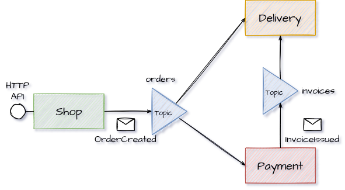

# Scenario

# Run

- Start a local rabbitmq broker, e.g. via `./run-rabbitmq.sh` or similar; the broker is expected
  to listen on `localhost:5672`
- Start shop, delivery and payment via `mvn spring-boot:run`
- Create orders via `curl -X POST http://localhost:8080/create-order`

# Relevant issues

- [Proposal to solve publish/subscribe confusion](https://github.com/asyncapi/spec/issues/618):
  Current (2021-10-17) proposal that addresses a number of relevant issues of the specification
  (e.g. publish/subscribe naming, reusable artifacts, description of channels/messages/schemas
  without immediate relation to an application).

- [API documentation strategies](https://github.com/asyncapi/spec/issues/300): The issue describes
  different documentation approaches for API descriptions: specification per application vs. single
  specification for API.

- [\[2.0.0 REVIEW\] An application is not an API in
  EDA](https://github.com/asyncapi/spec/issues/223): The issue describes the idea of the API
  description being a contract that is not "owned" by a particular application. Issue was discussed
  and closed. Unfortunately no further explanation was provided.

  A similar idea is described in issue [Consider v2 spec usage
  clarification](https://github.com/asyncapi/spec/issues/196).

- [Deduplication and workflow concerns/questions](https://github.com/asyncapi/spec/issues/233): The
  issue proposes to separate the exposed APIs of an application from the ones it consumes in its API
  description.

# Links

- [Organizing your AsyncAPI
  documents](https://medium.com/asyncapi/organizing-your-asyncapi-documents-12bccecd9ced)

<!-- vim: set tw=100: -->
